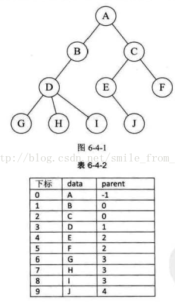
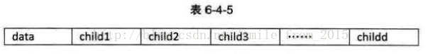
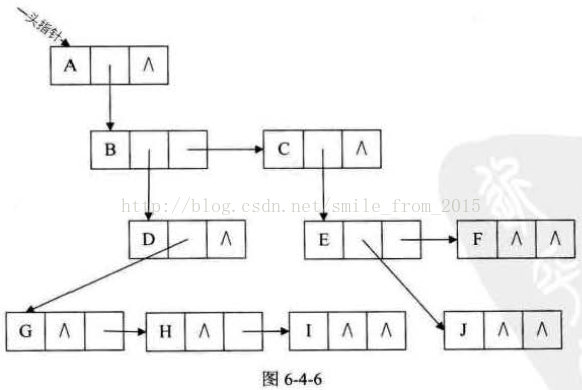
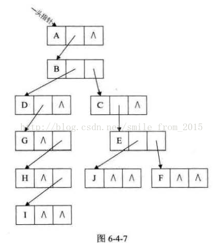

# 树的基本概念与存储结构详解

## 一、树的基本定义

### 1.1 树的定义
树（Tree）是n（n≥0）个结点的有限集。当n=0时，称为空树；当n>0时，具有以下特点：
- 有且仅有一个特定的结点称为根（Root）结点
- 当n>1时，其余结点可分为m（m>0）个互不相交的有限集T1, T2, ..., Tm，其中每一个集合本身又是一棵树，称为根的子树（SubTree）

### 1.2 树的特点
- 树中没有回路（环）
- 任意两个结点之间有且仅有一条路径
- 除根结点外，每个结点有且仅有一个双亲结点
- n个结点的树有n-1条边

## 二、结点的分类

### 2.1 按层次分类
- **根结点（Root）**：树的顶层结点，没有双亲结点
- **内部结点（Internal Node）**：有子树的结点
- **叶子结点（Leaf Node）**：没有子树的结点，也称为终端结点
- **分支结点（Branch Node）**：度不为0的结点（即非叶子结点）

### 2.2 按度数分类
- **度（Degree）**：结点拥有的子树数目
- **度为0的结点**：叶子结点
- **度为1的结点**：只有一个子树的结点
- **度为k的结点**：有k个子树的结点

## 三、结点间的关系

### 3.1 基本关系
- **双亲（Parent）**：若结点A是结点B的子树的根，则A是B的双亲
- **孩子（Child）**：若结点A是结点B的子树的根，则B是A的孩子
- **兄弟（Sibling）**：具有相同双亲的结点互为兄弟
- **祖先（Ancestor）**：从根到该结点所经分支上的所有结点
- **子孙（Descendant）**：以某结点为根的子树中的任一结点

### 3.2 层次关系
- **结点的层次（Level）**：从根开始定义，根为第一层，根的孩子为第二层
- **结点的深度（Depth）**：从根结点到该结点的路径长度
- **结点的高度（Height）**：从该结点到叶子结点的最长路径长度
- **树的深度/高度**：树中结点的最大层次数

## 四、树的其他重要概念

### 4.1 有序树与无序树
- **有序树**：树中结点的子树从左到右是有次序的，不能互换
- **无序树**：树中结点的子树没有次序关系

### 4.2 森林（Forest）
森林是m（m≥0）棵互不相交的树的集合。

### 4.3 路径与路径长度
- **路径**：树中两个结点之间的路径是这两个结点之间经过的分支序列
- **路径长度**：路径上的分支数目

## 五、树的存储结构

### 5.1 双亲表示法（Parent Representation）
使用一组连续的存储空间来存储树中的结点，同时在每个结点中附设一个指示器指示其双亲结点在表中的位置。

```cpp
// 双亲表示法的结点结构
typedef struct PTNode {
    ElemType data;      // 结点数据
    int parent;         // 双亲位置
} PTNode;

typedef struct {
    PTNode nodes[MAX_TREE_SIZE];  // 结点数组
    int r;              // 根的位置
    int n;              // 结点数
} PTree;
```

**优点**：
- 可以快速找到结点的双亲
- 存储结构简单

**缺点**：
- 找孩子结点需要遍历整个数组
- 求结点的孩子时效率较低

### 5.2 孩子表示法（Children Representation）
把每个结点的孩子结点排列起来，看成是一个线性表，用带头结点的单链表存储。

```cpp
// 孩子结点
typedef struct CTNode {
    int child;          // 孩子结点在表中的下标
    struct CTNode* next; // 指向下一个孩子结点的指针
} CTNode, *ChildPtr;

// 表头结构
typedef struct {
    ElemType data;      // 存储结点数据
    ChildPtr firstchild; // 指向第一个孩子结点
} CTBox;

// 孩子表示法结构
typedef struct {
    CTBox nodes[MAX_TREE_SIZE]; // 结点数组
    int r;              // 根的位置
    int n;              // 结点数
} CTree;
```
指针域的个数就等于树的度，复习一下，树的度就是树各个节点度的最大值。

其中data是数据域。childl到childd是指针域，用来指向该节点的孩子节点

**优点**：
- 便于查找结点的孩子
- 便于实现树的各种操作

**缺点**：
- 找双亲结点需要遍历所有孩子链表
- 每个结点的链表长度不同

### 5.3 孩子兄弟表示法（Child-Sibling Representation）
又称二进制树表示法，每个结点包含三个域：数据域、指向第一个孩子结点的指针域、指向右兄弟结点的指针域。

```cpp
typedef struct CSNode {
    ElemType data;              // 数据域
    struct CSNode* firstchild;  // 指向第一个孩子结点
    struct CSNode* rightsib;    // 指向右兄弟结点
} CSNode, *CSTree;
```



**优点**：
- 可以方便地找到孩子和兄弟
- 容易转换为二叉树
- 存储密度相对较高

**缺点**：
- 查找双亲需要遍历整棵树
- 某些操作相对复杂

### 5.4 度数表示法（Degree Representation）
记录每个结点的度数和指向孩子结点的指针。

```cpp
typedef struct DNode {
    ElemType data;              // 数据域
    int degree;                 // 度数
    struct DNode** children;    // 指向孩子结点的指针数组
} DNode;
```

## 六、特殊类型的树

### 6.1 二叉树（Binary Tree）
每个结点最多只有两棵子树（即度≤2）的树，且子树有左右之分，不能任意颠倒。

### 6.2 满二叉树（Full Binary Tree）
深度为k且含有2^k-1个结点的二叉树。

### 6.3 完全二叉树（Complete Binary Tree）
深度为k的具有n个结点的二叉树，当且仅当其每一个结点都与深度为k的满二叉树中编号从1至n的结点一一对应时，称为完全二叉树。

### 6.4 二叉搜索树（Binary Search Tree）
对于树中任意结点，其左子树上所有结点的值均小于该结点的值，右子树上所有结点的值均大于该结点的值。

## 七、树的性质

### 7.1 基本性质
1. 树中的结点数等于所有结点的度数加1
2. 度为m的树中第i层上至多有m^(i-1)个结点（i≥1）
3. 高度为h的m叉树至多有(m^h-1)/(m-1)个结点
4. 具有n个结点的m叉树的最小高度为log_m(n(m-1)+1)

### 7.2 二叉树的特殊性质
1. 在二叉树的第i层上至多有2^(i-1)个结点（i≥1）
2. 深度为k的二叉树至多有2^k-1个结点（k≥1）
3. 对任何一棵二叉树T，如果其终端结点数为n0，度为2的结点数为n2，则n0 = n2 + 1

## 八、树的应用

### 8.1 实际应用
- 文件系统的目录结构
- XML/HTML文档结构
- 决策树
- 表达式解析树
- 数据库索引（B树、B+树）

### 8.2 算法应用
- 树的遍历算法（前序、中序、后序、层次遍历）
- 最小生成树算法（Prim、Kruskal）
- 最短路径算法
- 树形动态规划

## 九、常见问题与注意事项

### 9.1 易混淆概念
- **结点的度** vs **树的度**：结点的度是该结点子树的个数，树的度是树中结点的最大度数
- **深度** vs **高度**：深度是从根开始计算，高度是从叶子开始计算
- **有序树** vs **无序树**：注意题目是否说明树的有序性

### 9.2 存储结构选择
- 频繁访问双亲 → 双亲表示法
- 频繁访问孩子 → 孩子表示法
- 需要转换为二叉树 → 孩子兄弟表示法

树作为重要的非线性数据结构，在计算机科学中有着广泛的应用，理解其基本概念和存储结构对于学习更复杂的数据结构和算法至关重要。